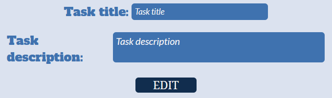

# ToDo List created in React

This is a ToDo List created to train my programming skills in SCSS, JavaScript and React.

## Running

After you clone it from GitHub to your local folder.
To download node modules, use:

```
"npm install"
```

To open http://localhost:3000 to view it in the browser, use:

```
"npm start"
```

## ToDo List Inputs

ToDo List inputs consist of two inputs ("Task Title" and "Task Description").
The "Task Title" value has to be longer than 3 signs, and "Task Description" value has to longer than 10 signs.
Only when those conditions are true, the new task can be add.
If one of the conditions after the "ADD" button is clicked is false than below the input an error message is shown.


## ToDo List Tasks

List divide into two sections "Tasks" that contains only unfinished tasks and "Tasks done" that contains only finished (succesfully) tasks. Deleted tasks won't appear anywhere.

## ToDo List Task

When new task is created, it's added into "Tasks" section with open description and visible buttons.


Button in the top-right corner switches task's height. When hidden, only the button and "tashHeader" is shown.

Three button in the bottom-right corner are (from the left to right) "Task Confirm", "Task Edit" and "Task Delete".

"Task Confirm" confirmed that task is completed and remove it from "Tasks" section into "Tasks Done".
"Task Edit" get's the task title and description and put it into specific inputs inside "Inputs" section. The background color of the inputs is changed for the user to notice the place where the task is going to be edit. Also the previously "ADD" button changes into "EDIT" button. 



"Task Delete" deletes the task from the arrays.

## ToDo List Task inside Tasks Done

After task is completed and moved into "Tasks Done" section, the button in the top-right corner is still fully functional. 
The task can't be moved back into "Tasks" section and also can't be edited or deleted. 