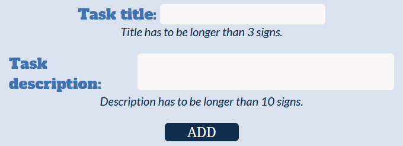
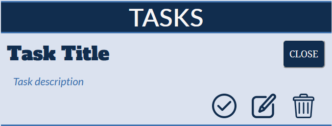

# ToDo List created in React

This is a ToDo List created to train my programming skills in SCSS, JavaScript and React.

## Running

After you clone it from GitHub to your local folder.
To download node modules, use:

```
"npm install"
```

To open http://localhost:3000 to view it in the browser, use:

```
"npm start"
```

## ToDo List inputs

ToDo List inputs consist of two inputs ("taskHeader" and "taskDesc").
The "tashHeader" value has to be longer than 3 signs, and "taskDesc" value has to longer than 10 signs.
Only when those conditions are true, the new task can be add.
If one of the conditions after the "ADD" button is clicked is false than below the input an error message is shown.



## ToDo List tasks

List divide into two sections "Tasks" that contains only unfinished tasks and "Tasks done" that contains only finished (succesfully) tasks. Deleted tasks won't appear anywhere.

## ToDo List task

When new task is created, it's added into "Tasks" section with open description and visible buttons.


